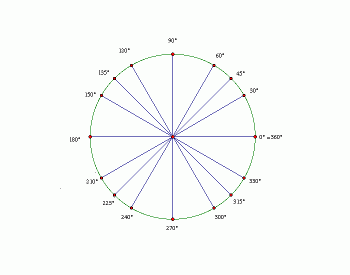
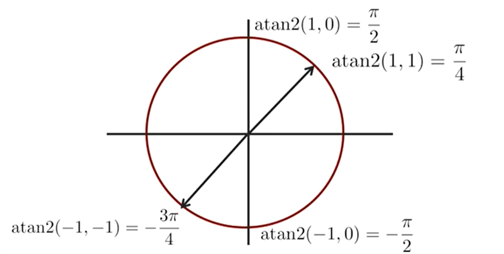
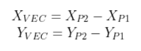

<details>
<summary style="font-size:30px; font-weight: bold">PioneerHumanTracking - Оглавление</summary>

- [Описание проекта](#-Описание-проекта)
  * [Описание](#Описание)
  * [Возможные проблемы при текущей реализации проекта:](#--------------------------------------------------)
  * [Команды (позы)](#Команды-(позы))
- [Установка компонентов](#Установка-компонентов)
  * [Python](#python)
  * [PyCharm (Необязательно)](#PyCharm-(Необязательно))
  * [Пакеты для Python](#Пакеты-для-Python)
- [Описание исходного кода](#Описание-исходного-кода)
  * [Модули](#Модули)
  * [Переменные](#Переменные)
  * [Функции](#Функции)
    + [remap(oldValue, oldMin, oldMax, newMin, newMax)](#remapoldvalue-oldmin-oldmax-newmin-newmax)
    + [convert_points(points)](#convert_pointspoints)
    + [ang(v1)](#angv1)
    + [generate_parts_vectors(pts)](#generate_parts_vectorspts)
    + [eq(num1, num2, err=10)](#eqnum1-num2-err10)
    + [eq_all(lside=[], rside=[], neck=[])](#eq_alllside-rside-neck)

</details>

# Описание проекта

## Описание

В данном проекте реализовывается возможность отслеживания действий человека во время автономного полета квадрокоптера «Геоскан Пионер Мини».

С помощью нейронных сетей, которые занимаются распознаванием скелета человека на изображении, программа умеет удерживать человека в кадре ровно по центру и на заданном расстоянии, а также детектировать настраиваемые жесты, которые могут означать всевозможные команды: фотографирование, посадка, подлет ближе к человеку, смещение вбок и так далее.

## Возможные проблемы при текущей реализации проекта:
  * Иногда возможно определение скелета с невысокой точностью. Попробуйте изменить фон, чтобы тело было контрастно.
  * Недостаточная скорость реакции на изменение положения человека в пространстве. Исправляется постепенным увеличением коэффициентов регуляторов.

## Команды (позы)
* Поднятая вверх согнутая левая рука - подлет ближе
  
  
  
* Поднятая вверх согнутая правая рука - отлет дальше

  

* Вытянутая вбок левая рука - движение влево

  

* Вытянутая вбок правая рука - движение вправо

  

* Скрещенные перед грудью руки - фотография

  

* Две опущенные руки, согнутые в локтях - посадка

  

# Установка компонентов
> **Важное примечание!**
> 
> *В данном разделе инструкции представлены для графических операционных систем. Во всех операционных системах процесс установки компонентов не отличается, за исключением систем без графического интерфейса в моменте установки интерпретатора Python и среды разработки PyCharm.*
>
> *Если вы используете в качестве операционной системы не Windows или Mac, то перед установкой пакетов через PIP необходимо установить дополнительные пакеты для самой ОС следующей командой:*
>
>       sudo apt-get install libxml2-dev libxslt-dev python-dev

## Python

Для повторения данного проекта, как и программирования квадрокоптера «Геоскан Пионер Мини» необходимо установить интерпретатор языка программирования Python (версия 3.7 и выше) на ваш компьютер. Это, необходимо, так как все вычисления будут проводиться на компьютере, а на квадрокоптер будут отправляться лишь команды по типу «Лететь в точку».

Чтобы установить интерпретатор языка Python, необходимо перейти на [официальный сайт](https://www.python.org/), открыть вкладку Downloads и выбрать All releases для открытия страницы со всеми релизами Python.


На 04.07.2021 рекомендуется скачивать версию 3.7.Х или 3.8.Х


## PyCharm (Необязательно)
PyCharm – это среда разработки с большим функционалом для удобного написания программ, например, удобные подсказки, или интеграция с системой контроля версий GIT (нуждается в отдельной установке) и др.

Для установки среды разработки PyCharm следует также перейти на [официальный сайт](https://www.jetbrains.com/ru-ru/pycharm/download/) и выбрать версию Community, так как она полностью бесплатна.


После скачивания установочного файла, процесс установки не будет отличаться от установки любой другой программы на ваш ПК.

## Пакеты для Python

Для удобства установки всех необходимых пакетов в корне проекта существует специальных файл, хранящий названия нужных библиотек – requirements.txt. Чтобы установить все библиотеки, которые прописаны внутри него, достаточно вызвать следующую команду:

    pip3 install -r requirements.txt

После чего нужно всего лишь дождаться окончания установки всех модулей.

# Описание исходного кода
## Модули
Импорт необходимых модулей:
```python
import cv2
import mediapipe as mp
import numpy as np
from piosdk import Pioneer
from collections import namedtuple
import time
```
Пройдемся по библиотекам:
* **cv2** - это библиотека OpenCV. Она предназначена для работы с компьютерным зрением.
* **mediapipe** - это библиотека, разработанная компанией Google для определения на изображении различных частей тела, а если быть точнее, то различных точек на теле человека, из которых уже и стоится его скелет, руки, лицо и прочее. Подробное описание библиотеки mediapipe находится на [официальном сайте](https://google.github.io/mediapipe/).
* **numpy** - библиотека, предназначенная для удобной и оптимизированной работы с большими числовыми массивами и просто различными математическими функциями.
* **collections** - стандартная библиотека, которая дает дополнительные возможности по работе с массивами данных. В данном случае из этой библиотеки используется лишь ее часть под названием namedtuple. С помощью этого класса в дальнейшей работе можно легко создавать массивы, где у каждого элемента будет своё имя.
* **time** - библиотека для работы со временем.
* **piosdk** - эта библиотека для непосредственного взаимодействия с квадрокоптером. Она не нуждается в установке, так как находится внутри проекта.

-----------------------

## Переменные

Далее идет строка настройки, откуда будет идти видео: с квадрокоптера или с вашей веб-камеры:
```python
# использование встроенной камеры или камеры квадрокоптера
useIntegratedCam = False
```
Дело в том, что такое решение позволяет очень удобно и хорошо отлаживать те части программы, в которых напрямую не задействован квадрокоптер, то есть, например, при тестировании определения скелета человека на изображении.

-----------------------

Следующим блоком идет создание объекта, через который в дальнейшем будет происходить считывание видеопотока, то есть в зависимости от выбранной ранее настройки будет создан либо объект, через который будет происходить взаимодействие с квадрокоптером, либо объект, через который будет только приходить видео с веб-камеры компьютера:
```python
# создание источников видео в зависимости от переменной
if not useIntegratedCam:
    pioneer = Pioneer()
else:
    cap = cv2.VideoCapture(0)
```

-----------------------

Далее идет блок кода относящийся уже к конфигурированию нейросети для определения скелета человека:
```python
# создание объектов для работы нейросети:
# для рисования
mpDrawings = mp.solutions.drawing_utils
# предварительный конфигуратор детектора
skeletonDetectorConfigurator = mp.solutions.pose
# создание детектора с некоторыми настройками
skDetector = skeletonDetectorConfigurator.Pose(static_image_mode=False,
                                               min_tracking_confidence=0.8,
                                               min_detection_confidence=0.8,
                                               model_complexity=2)
```

Здесь нужно пояснить, что Mediapipe - весьма обширная библиотека, включающая в себя множество модулей и дающая множество возможностей. Так, она включает в себя как модули для обнаружения различных точек на теле, так и модули для отрисовки этих точек на изображении. Именно поэтому мы видим, как из библиотеки mediapipe берутся модули drawing_utils (отвечает за рисование) и pose (отвечает за детект скелета на изображении). 

Однако в случае с pose мы берем просто сырой класс, из которого нужно еще правильно создать уже полноценный объект, который и будет определять скелет на изображении с заданными нами настройками. Это делается в последней строке данного блока кода. В этой строке можно заметить 4 параметра:
* **static_image_mode** - параметр. отвечающий за то, в каком режиме будет работать программа: со статичным изображением или же с видеопотоком.
* **min_tracking_confidence** - параметр, отвечающий за минимальный предел трекинга точки. Дело в том, что данная библиотека для значительного ускорения своей работы использует нейросети не для каждого кадра. В начальный момент нейросеть определяет точки свелета на изображении, а затем эти точки с помощью алгоритмов компьютерного зрения просто отслеживаются, и когда точность слежения падает ниже значения, заданного этим параметром, то происходит новое включение нейросети.
* **min_detection_confidence** - параметр, который отвечает так же за нижний порог, только на этот раз за порог точности детектирования нейросетью точек, то есть если нейросеть определяет точки скелета с точностью меньше, чем указано данным параметром, то предсказания сбрасываются, то есть ничего не возвращается в программу, пока определение не пройдет качественно.
* **model_complexity** - "тяжеловесность" модели. Данный параметр отвечает за то, с какой точностью и скакими затратами ресурсов в принципе нейросеть будет пытаться выполнять свою работу:
    * 0 - для устройств, которые не обладают большой вычислительной мощностью, результаты не очень точны.
    * 1 - для устройств, обладающих средней вычислительной мощностью, определение имеет ошибки в относительно сложных условиях, например, при небольших засветах.
    * 2 - для устройств с хорошей вычислительно мощностью, определение будет очень хорошим даже в сложных условиях.

-----------------------

Затем идет большой блок с объявлением различных переменных, много о которых не скажешь:
```python
# объявление переменных, хранящих ширину и высоту изображения
IMGW, IMGH = None, None

# объявление переменной, хранящей значение нажатой кнопки
key = -1

# объявление переменной, хранящей время начала отсчета таймера для фотографирования
# то есть текущее время на момент прихода команды на создание фотографии
take_photo_time = -1

# объявление переменной, хранящей время начала отсчета таймера для следующего детектирования жестов
# то есть текущее время на момент детектирования жеста, для создание небольшой задержки до след. срабатывания
pose_detected = -1

# переменные, хранящие положение квадрокоптера в пространстве
cordX = .0
cordY = .0
cordZ = 1.5
yaw = np.radians(0)

# шаг, на который будет происходить изменение положения квадрокоптера при выполнении команд
stepXY = 0.2
```

Так же этот блок продолжается объявлением переменных для работы Пропорционально-Дифференциальных регуляторов, которые занимаются удержанием человека в центре изображения и заданного до него расстояния:
```python
# переменные для работы ПД регулятора при повороте
yaw_err = 0
yaw_errold = 0
yaw_kp = .005
yaw_kd = .0025
yaw_k = 0.01

# переменные для работы ПД регулятора при движении вверх/вниз
z_err = 0
z_errold = 0
z_kp = .00004
z_kd = .00001

# переменные для работы ПД регулятора при движении вперед/назад
y_err = 0
y_errold = 0
y_kp = .12
y_kd = .01
```

-----------------------

Далее объявляется словарь (переменная типа dict), в котором описываются используемые в работе части тела человека (шея, плечо, предплечье и т.д.) и точки, эти части тела образующие, а точнее, то индексы этих точек:
```python
# имена частей тела с индексами точек, образующих их
JOINTS_LIST = {"neck": [33, 0],
               "left_clavicle": [33, 12],
               "left_arm": [12, 14],
               "left_forearm": [14, 16],
               "right_clavicle": [33, 11],
               "right_arm": [11, 13],
               "right_forearm": [13, 15]}
```
Имена частей тела выбираются и задаются произвольно, ведь это как раз тот блок, который может активно изменяться: если вы собираетесь показывать какие-то жесты ногами, то их спокойно можно сюда добавить по аналогии с представленными частями тела. 

Индексы точек берутся основываясь на картинке, которая взята с официального сайта проекта Mediapipe из раздела Pose:


> **Важное примечание!**
> 
> *Как можно заметить из представленной схемы выше - в скелете нет 33-й точки, которая как-то используется в словаре. Это точка будет расчитываться в программе самостоятельно и добавляться в массив с оригинальными точками.* 
>
> *33-я точка - это центральная точка между лопатками.*

-----------------------

Последним блоком объявления переменных идет создание уникальных именованных массивов:
```python
# массив Точка имеет 4 именованных параметра, описывающих точку скелета
Point = namedtuple('Point', 'x y z visibility')

# массив, содержащий сгенерированные части тела в виде векторов,
# в котором к элементам можно обратиться через точку
Parts = namedtuple("Parts", JOINTS_LIST.keys())

# массив, описывающий конкретную часть тела в виде вектора
Part = namedtuple("Part", 'x y angle')
```
Объявление массивов таких типов случит исключительно для удобства, ведь хранить данные можно было бы и в обычных кортежах, но обращение к элементам по числовому индексу вносило бы сильную путаницу.

Так, массив Point позволят удобно описать точку скелета, имеющую 4 параметра: 3 пространственные координаты и видимость.

Массив Part позволяет уже описать конкретную часть тела в виде вектора, например, предплечье. У вектора в данном случае есть 3 параметра: координаты на плоскости и направление. <u>**Направление у всех векторов является глобальным**</u>, то есть не зависит от положения предыдущей части тела. Угол измеряется в градусах и отсчитывается от положительной оси X на координатной плоскости:



Массив Parts в свою очередь хранит в себе предыдущие массивы типа Part. Обращение к элементам происходит по именам, прописанным в массиве JOINTS_LIST. Служит опять же для упрощения написания и читабельности кода.

-----------------------

## Функции

### remap(oldValue, oldMin, oldMax, newMin, newMax)

Первой идет функция для преобразования числа из одного диапазона в другой, под названием **<u>remap</u>**:
```python
def remap(oldValue, oldMin, oldMax, newMin, newMax):
    """
    Функция для преобразования числовых значений из одного диапазона в другой
    """
    oldRange = (oldMax - oldMin)
    if (oldRange == 0):
        newValue = newMin
    else:
        newRange = (newMax - newMin)
        newValue = (((oldValue - oldMin) * newRange) / oldRange) + newMin
    return newValue
```

-----------------------

### convert_points(points)

Далее определяется функция **<u>convert_points</u>**, которая преобразует относительные координаты всех точек в глобальные. Изначально, после определения нейросетью точек на теле человека, их координаты имеют дробные значения в диапазоне от 0 до 1, данная функция занимается преобразованием дробного числа в привычные координаты в пикселях. Для преобразования обязательно должны быть объявлены переменные IMGW и IMGH, хранящие ширину и высоту изображения в пикселях соответственно.

Также в этой функции производится вычисление 33й, базовой точки, которая находится между лопатками.
```python
def convert_points(points):
    """
    Функция для конвертации определенных нейросетью точек скелета
    из относительных координат (0-1.0) в абсолютные координаты
    """
    # массив, в котором будут храниться конвертированные точки
    converted_points = []

    # генерация базовой точки (между лопатками)
    # х - (х левой лопатки + х правой лопатки) / 2
    # у - (у левой лопатки + у правой лопатки) / 2
    # остальное по аналогии
    base_point = Point(x=round(IMGW * (points[12].x + points[11].x) // 2),
                       y=round(IMGH * (points[12].y + points[11].y) // 2),
                       z=(points[12].z + points[11].z) / 2,
                       visibility=(points[12].visibility + points[11].visibility) / 2)
    # непосредственная конвертация координат точек путем умножения
    # относительной координаты на ширину(высоту) изображения
    # (z и видимость остаются без изменений)
    for p in points:
        converted_points.append(Point(x=round(IMGW * p.x),
                                      y=round(IMGH * p.y),
                                      z=p.z,
                                      visibility=p.visibility))
    # добавление базовой точки в конец массива
    converted_points.append(base_point)
    return converted_points
```

-----------------------

### ang(v1)

Затем идет небольшая функция **<u>ang</u>**, которая возвращает направление вектора:
```python
def ang(v1):
    """
    Функция рассчитывает направление вектора на плоскости и возвращает угол от 0 до 359
    """
    angle = round(np.degrees(np.arctan2(v1[1], -v1[0])))
    angle = remap(angle, -180, 179, 0, 359)
    return round(angle)
```
Здесь используется функция arctan2, которая позволяет правильно определить угол, на который повернут вектор. Используя только одну известную всем со школы тригонометрическую функцию (sin, cos, tan) добиться правильного определения угла сложно, так как все они имеют некоторые ограничения, например, синус может выдавать одинаковые значения в разных точках, что недопустимо. Arctan2 исправляет все эти нодостатки и позволяет получать абсолютно верные углы:



Как видно из иллюстрации, углы вычисляются в радианах, поэтому их надо конвертировать в градусы используя функцию degrees, после чего округлить функцией round, а в конце для удобства представления происходит изменение диапазона значений с [-179, 180] на [0, 359] функцией remap.

Функция arctan2 принимает 2 аргумента: У-координата вектора, Х-координата вектора.

-----------------------

### generate_parts_vectors(pts)

Далее идет функция **<u>generate_parts_vectors</u>**, которая выражает все части тела через векторы:
```python
def generate_parts_vectors(pts):
    """
    Функция для представления частей тела в виде векторов.
    Принимает набор точек, а возвращает вектора.
    """
    j = {}
    # проход по элементам словаря с именами и точками частей тела
    for joint in JOINTS_LIST.items():
        # 2 точки, образующие часть тела
        pos = joint[1]
        # из переданного набора найденных точек скелета выбираются эти 2 и считается вектор
        vec_x = pts[pos[1]].x - pts[pos[0]].x
        vec_y = pts[pos[1]].y - pts[pos[0]].y
        # сохранение вектора с именем части тела
        j.update({
            joint[0]: Part(vec_x, vec_y, ang([vec_x, vec_y]))
        })
    # конвертация в массив, к элементам которого можно обращаться через точку
    j = Parts(**j)
    return j
```
Расчет вектора происходит по следующей формуле:



-----------------------

### eq(num1, num2, err=10)

Затем идет функция **<u>eq</u>**, которая позволяет сравнить 2 <u>**не отрицательных**</u> числа, но с небольшой погрешностью, то есть ее можно назвать примерным сравнением:

```python
def eq(num1, num2, err=10):
    """
    функция для сравнивания двух чисел с погрешностью
    """
    if num1 < 0 or num2 < 0:
      return True
    return True if abs(num1-num2) <= err else False
```
Если одно из сравниваемых чисел будет отрицательным, то функция обязательно вернет True.

Она используется при определении поз, когда нужно сравнить идеальное значение направления вектора и его текущее значение. Вот наглядный пример:

Обратимся к рисунку, который уже был показан в самом начале. Нам нужно определить, что вектор, описывающий плечо направлен влево (180 град.), а предплечье - вверх (90 град.). Можно сравнивать и просто с конкретным числом встроенными в язык средствами, но тогда распознавание жестов будет очень плохим, так как в реальности согнуть руку на такие углы очень сложно. Поэтому и используется эта функция - чтобы жест было показать намного легче.


-----------------------

### eq_all(lside=[], rside=[], neck=[])

И последней идет функция **<u>eq_all</u>**, которая позволяет в удобной форме проверять направления всех описанных ранее векторов:

```python
def eq_all(lside=[], rside=[], neck=[]):
    """
    функция для быстрого сравнения всех прописанных векторов
    """
    ans = True
    if lside:
        ans = eq(parts.left_clavicle.angle, lside[0]) and \
              eq(parts.left_arm.angle, lside[1]) and \
              eq(parts.left_forearm.angle, lside[2]) and \
              ans
    if rside:
        ans = eq(parts.right_clavicle.angle, rside[0]) and \
              eq(parts.right_arm.angle, rside[1]) and \
              eq(parts.right_forearm.angle, rside[2]) and \
              ans
    if neck:
        ans = eq(parts.neck.angle) and \
              ans
    return ans
```

**Функция не является адаптивной!** Это значит, что она рассчитана только на текущую конфигурацию частей тела (две руки и шея). При добавлении новых частей тела данную функцию нужно будет редактировать.

В данную функцию передаются 3 массива, в которых последовательно передаются "идеальные" направления векторов (в град.).

Так, в массивах lside и rside обязательно должны быть 3 значения: 
1. направление вектора "лопатка"
2. направление вектора "плечо"
3. направление вектора "предплечье"

В массиве neck должно быть 1 значение: направление вектора "шея"

Перечисленные массивы могут не указываться, тогда определение позы не будет зависеть от не указанных частей тела. Например, если НЕ указывать массивы rside и lside, то определение будет зависеть только от направления шеи, а руки могут располагаться как угодно.