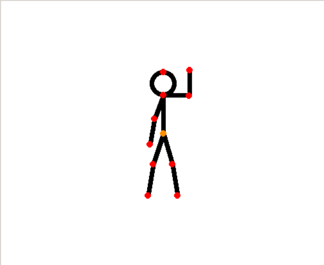
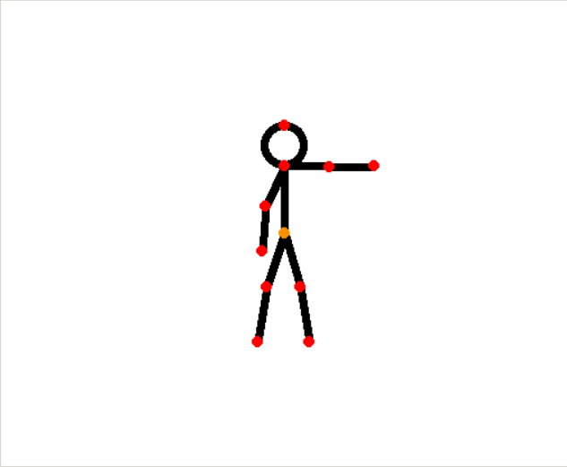

Дрон-фотограф
=============

Описание проекта
----------------

Описание
~~~~~~~~

В данном проекте реализовывается возможность отслеживания действий
человека во время автономного полета квадрокоптера «Геоскан Пионер
Мини».

С помощью нейронных сетей, которые занимаются распознаванием скелета
человека на изображении, программа умеет удерживать человека в кадре
ровно по центру и на заданном расстоянии, а также детектировать
настраиваемые жесты, которые могут означать всевозможные команды:
фотографирование, посадка, подлет ближе к человеку, смещение вбок и так
далее.

Возможные проблемы при текущей реализации проекта:
~~~~~~~~~~~~~~~~~~~~~~~~~~~~~~~~~~~~~~~~~~~~~~~~~~

-  Иногда возможно определение скелета с невысокой точностью. Попробуйте
   изменить фон, чтобы тело было контрастно.
-  Недостаточная скорость реакции на изменение положения человека в
   пространстве. Исправляется постепенным увеличением коэффициентов
   регуляторов.

Команды (позы)
~~~~~~~~~~~~~~

-  Поднятая вверх согнутая левая рука - подлет ближе

-  Поднятая вверх согнутая правая рука - отлет дальше

-  Вытянутая вбок левая рука - движение влево

-  Вытянутая вбок правая рука - движение вправо

.. figure:: ./readme_images/img_9.png
   :alt: img\_9.png

-  Скрещенные перед грудью руки - фотография

-  Две опущенные руки, согнутые в локтях - посадка

.. figure:: ./readme_images/img_12.png
   :alt: img\_12.png

Установка компонентов
---------------------

.. important::

    В данном разделе инструкции представлены для графических
    операционных систем. Во всех операционных системах процесс установки
    компонентов не отличается, за исключением систем без графического
    интерфейса в моменте установки интерпретатора Python и среды
    разработки PyCharm.

    Если вы используете в качестве операционной системы не Windows или
    Mac, то перед установкой пакетов через PIP необходимо установить
    дополнительные пакеты для самой ОС следующей командой:

    ::

          sudo apt-get install libxml2-dev libxslt-dev python-dev

Python
~~~~~~

Для повторения данного проекта, как и программирования квадрокоптера
«Геоскан Пионер Мини» необходимо установить интерпретатор языка
программирования Python (версия 3.7 и выше) на ваш компьютер. Это,
необходимо, так как все вычисления будут проводиться на компьютере, а на
квадрокоптер будут отправляться лишь команды по типу «Лететь в точку».

Рассмотрим установку интерпретатора Python для OS Windows.

Чтобы установить интерпретатор языка Python, необходимо перейти на
`официальный сайт <https://www.python.org/>`__, открыть вкладку
Downloads и выбрать All releases для открытия страницы со всеми релизами
Python.

.. figure:: ./readme_images/img.png
   :alt: img.png

\

На 04.07.2021 рекомендуется скачивать версию 3.7.Х или 3.8.Х

.. figure:: ./readme_images/img_1.png
   :alt: img\_1.png

\

Некоторые релизы не имеют установочных файлов, поэтому поищите версии, в которых будут файлы установки под вашу операционную систему, блок с файлами на странице релиза будет выглядеть примерно так:

\

Здесь следует выбрать Windows installer (64 или 32 bit в зависимости от вашей OS)

Запустите скачанный установочный файл и обязательно выберите оба пункта внизу окна, после чего нажмите Install now:

\

После окончания установки отключите ограничение на длину переменной Path, нажав на соответствующую кнопку:

.. figure:: ./readme_images/img_15.png
   :alt: img\_15.png

\

PyCharm (Необязательно)
~~~~~~~~~~~~~~~~~~~~~~~

PyCharm – это среда разработки с большим функционалом для удобного
написания программ, например, удобные подсказки, или интеграция с
системой контроля версий GIT (нуждается в отдельной установке) и др.

Для установки среды разработки PyCharm следует также перейти на
`официальный сайт <https://www.jetbrains.com/ru-ru/pycharm/download/>`__
и выбрать версию Community, так как она полностью бесплатна.

\

После скачивания установочного файла, процесс установки не будет
отличаться от установки любой другой программы на ваш ПК.

Скачивание проекта
~~~~~~~~~~~~~~~~~~

Есть два варианта скачать проект:

1. Если у вас установлен Git, то откройте командную строку в директории, куда хотите сохранить папку с проектом и выполните команду:

    .. code::

        git clone https://github.com/DgtalCode/PioneerHumanTracking.git

   У вас появится папка PioneerHumanTracking, где будут лежать все исходные файлы.

2. Если у вас Git не установлен, то перейдите
   `на страницу  <https://github.com/DgtalCode/PioneerHumanTracking>`__
   проекта на GitHub и скачайте zip архив, нажав на зеленую кнопку в верхней части экрана. Распакуйте архив в любую удобную папку.

Пакеты для Python
~~~~~~~~~~~~~~~~~

Сперва нужно установить пакет, который будет использоваться для установки других пакетов:

::

    pip3 install wheel

А далее, для удобства установки всех необходимых пакетов, в корне проекта
существует специальный файл, хранящий названия нужных библиотек –
requirements.txt. Чтобы установить все библиотеки, которые прописаны
внутри него, достаточно вызвать следующую команду:

::

    pip3 install -r requirements.txt

После чего нужно всего лишь дождаться окончания установки всех модулей.

Описание исходного кода
-----------------------

Описание исходного кота доступно на странице проекта `на сайте <https://pioneer-doc.readthedocs.io/ru/master/learning-cases/pioneer-human-tracking/pioneer_human_tracking.html>`__ Геоскан